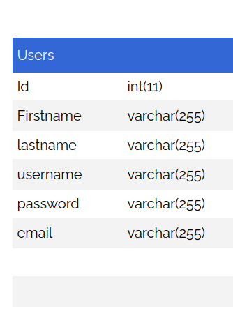

#CodeOp Group Project 3 BreakTime

## Introduction

The "BreakTime " s a guide to the simpler lives we all crave and deserve. is an application build with Express for the backend server, MySQL is the database to hold the information and React 18 for the front end.

## Setup

### Dependencies

- Run `npm install` in project directory. This will install server-related dependencies such as `express`.
- `cd client` and run `npm install`. This will install client dependencies (React).

### Database Prep

- Access the MySQL interface in your terminal by running `mysql -u root -p` or use the MySQL CLI.
- Create a new database called TBD: `create database breaktime`
- Add a `.env` file to the project folder of this repository containing the MySQL authentication information for MySQL user. For example:

```bash
  DB_HOST=localhost
  DB_USER=root
  DB_NAME=breaktime
  DB_PASS=YOURPASSWORD
  SUPER_SECRET=shhhhhhhhh
```

- Run `npm run migrate` in the main folder of this repository, in a new terminal window. This will create a table called 'users' and 'messages' in your database.

### Database schema 


### Development

## Code & Functionality Overview

- **Front End**
We have 4 pages, First is the home page, and the other three are for different topics in our system, Move = exercises, Relax = meditation videos and Fun we have a Api for funy images and jokes. we have the Log out function to remove the token created and we have timer for each topic

- **Back End**
We have  Users table, this one we used for create the new users and the users can logIn in our system, our Back end is developed with Express, the other part for back we have reminder for the users in their emails.