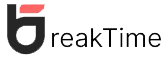

# Group Project - BreakTime



## Introduction

BreakTime is an app that helps you take breaks between work. It sends an email reminder when it's time to take a break, allows you to set a timer and provides activity suggestions to help you unwind. 

You can find a live version [here](https://breaktime.herokuapp.com/)

This is a Code-Op Group project developed with @monicalopez1991, @LouiseB96 and @gabriela-caeiro 🤍


## Technologies

It is built with Express for the backend server, MySQL for the database, React for the front end. It uses API Ninja, Cats API and Dogs API to fetch data and images for the FunBreak category. 

You can read more about each API:
- API Ninja's / Facts [here](https://api-ninjas.com/api/facts)
- API Ninja's / Quotes [here](https://api-ninjas.com/api/quotes)
- API Ninja's / Jokes [here](https://api-ninjas.com/api/jokes)
- Cats API [here](https://developers.thecatapi.com/view-account/ylX4blBYT9FaoVd6OhvR?report=bOoHBz-8t)
- Dogs API [here](https://developers.thecatapi.com/view-account/ylX4blBYT9FaoVd6OhvR?report=8FfZAkNzs)

## Setup

### Dependencies

- Run `npm install` in project directory. This will install server-related dependencies such as `express`.
- `cd client` and run `npm install`. This will install client dependencies (React).

### Database Prep

- Access the MySQL interface in your terminal by running `mysql -u root -p` or use the MySQL CLI.
- Create a new database called TBD: `create database breaktime`
- Add a `.env` file to the project folder of this repository containing the MySQL authentication information for MySQL user. For example:

```bash
  DB_HOST=localhost
  DB_USER=root
  DB_NAME=breaktime
  DB_PASS=YOURPASSWORD
  SUPER_SECRET=shhhhhhhhh
```
- Run `npm run migrate` in the main folder of this repository, in a new terminal window. This will create a table called 'users'

- Notes about users table:
  - `id` -- This column is generated automatically in the database. It serves as the primary key for the table.
  - `email` -- This column holds user's email. This will be used to send reminders.
  - `password` -- This column holds an encrypted password.

### Development

## Code & Functionality Overview

- **Front End**
This project includes Pages, Components, Hooks/ReactContexts and Local Files (i.e. videos, images)

**Pages:**
- Home
- FunBreak
- RelaxBreak
- MoveBreak

**Components:**
- Login
- BreakEnd
- FunContainer
- FunDisplayBox
- ShowCounter
- CountDownTimer
- DateTimeDisplay
- StartButton
 
**Hooks/ReactContexts:** 
- TimerContext
- UserContext
- useCountDown

**Local Files:** 
- Illustrations
- MoveImages
- RelaxVideos
 
- **Back End**
 - The project uses `users` MySQL table to store user info for user login and sending reminder emails.
 - `api.js` includes all the router function for login.
 - `index.js` includes all of the router functions for scheduling and sending reminders.
 - `services.js` includes all code to fetch data from the external API for FunBreak category.
 - The project uses **nodemailer** and **node-cron** modules for scheduling and sending email reminders. You can read more about nodemailer [here](https://nodemailer.com/about/) and node-cron [here](https://www.npmjs.com/package/node-cron)


## Thank you!

